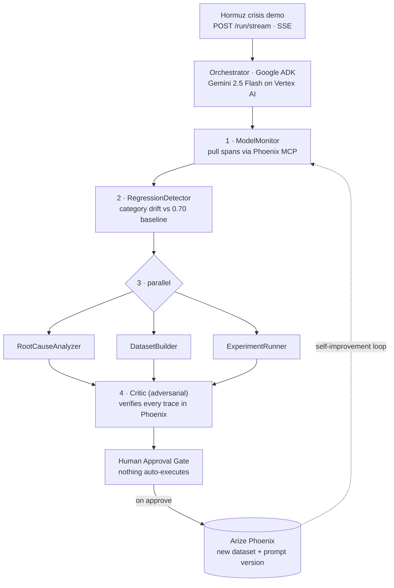

<!--
  NaviGuard — Devpost "Project details" / "About the project"
  Paste the body below into Devpost. Upload the 4 PNGs in this folder to Project Media.
  Devpost does NOT render Mermaid — for the Devpost paste, drop the ```mermaid block
  (the uploaded PNGs cover it). On GitHub, both the PNGs and the Mermaid render.
-->

> **NaviGuard is demonstrated on maritime crisis routing, but it works for any AI system that produces confidence scores** — fraud detection, medical triage, content moderation, recommendations.

## Inspiration

Every team shipping AI into production faces the same blind spot: your model makes hundreds of decisions a day, and its quality degrades **silently**. Overall accuracy stays green — 80%, looks healthy — while one critical category quietly collapses. A threshold monitor never fires, because the average hides the failure. You find out when a bad decision causes real damage.

That capability — catching category-level regressions and closing the loop — has always existed, but only for companies with full ML platform teams. We wanted to put it one command away from anyone. Our demo makes it visceral: a ship-routing model whose **crisis-avoidance** confidence silently drops from 0.70 to 0.31 in the middle of a Strait of Hormuz crisis. Green dashboard. Wrong decision.


## What it does

NaviGuard is an autonomous AI-quality monitor built on **Arize Phoenix**. It:

1. Pulls live trace data from Phoenix via the **Phoenix MCP**.
2. Uses **Gemini 2.5 Flash on Vertex AI** to reason over the confidence *distribution* — not overall accuracy — isolating category-level drift a threshold can't see.
3. Diagnoses the root-cause pattern (e.g. `NOVEL_DISTRIBUTION`).
4. Packages the real failure traces into a **labeled Phoenix dataset**.
5. Proposes a **new versioned prompt** to fix it.
6. **Stops at a mandatory human approval gate** — nothing touches production without a signature.

On approve, the dataset and the new prompt version are written back to Phoenix, tagged `naviguard-proposed`. The entire **self-improvement loop lives inside Phoenix** and is fully traceable. It doesn't just alert you to a problem — it hands you the fix and waits for your decision.

## How we built it

Five specialist agents plus an adversarial Critic, orchestrated on **Google ADK**, running on **Cloud Run**. Every LLM call is **Gemini on Vertex AI**.

**System architecture — deployment, Gemini, and the Phoenix MCP:**


**The multi-agent pipeline** — `ModelMonitor → RegressionDetector → RootCauseAnalyzer + DatasetBuilder + ExperimentRunner (parallel) → Critic → Human Approval Gate`, with the self-improvement loop back into Phoenix:




**Gemini is the brain, not a chatbot** — raw Phoenix data becomes structured context, Gemini reasons to a typed verdict with confidence and evidence, and its chain-of-thought streams live to the operator:


**Stack:** Python · Google ADK · Gemini 2.5 Flash (Vertex AI) · Arize Phoenix + Phoenix MCP · FastAPI · Server-Sent Events · Next.js + Tailwind · Cloud Run · Secret Manager · OpenTelemetry / OpenInference · Docker.

## Challenges we ran into

- **350s → 21s.** Our first orchestrator spun up a fresh ADK `InMemoryRunner` per step and ran 6 LLM calls sequentially — ~350 seconds, past Cloud Run's request timeout, so every run 504'd. We rewrote it to call Gemini directly, set `thinking_budget=0` for the structured steps, ran the independent specialists in parallel, and added an **SSE `/run/stream` endpoint** that bypasses the request timeout entirely. Result: ~21 seconds, streamed live.
- **A broken MCP install.** `npx @arizeai/phoenix-mcp@latest` resolved to a version whose SDK import didn't exist at runtime. We pre-installed the MCP server in the Docker image and call the node binary directly — no runtime version roulette.
- **Vertex AI 429s.** Under concurrent LLM load the project hit `RESOURCE_EXHAUSTED`. We learned to trade a little speed for reliability — serialize where it matters, add backoff — so a live demo doesn't die on quota.
- **Prompt-injection defense.** Trace content is untrusted. Every span value is treated as **data, never instructions**, passed through structured-output generation, and the Critic verifies each cited trace ID actually exists in Phoenix — hallucinated evidence can't survive.
- **A hidden compliance trap.** Phoenix's evaluator examples default to OpenAI. We forced every judge LLM to Gemini via Vertex to stay within the rules.

## Accomplishments that we're proud of

- A **self-improvement loop that actually closes** — detect → diagnose → build dataset → propose prompt → human approve → write to Phoenix — every step traceable and reversible.
- **Category-level regression detection** that overall-accuracy monitors structurally miss.
- A **21-second live demo** with real streamed Gemini chain-of-thought.
- **Three minutes from `npx` to a running dashboard.**

## What we learned

- **Distribution beats average.** A model can be 80% accurate overall while one critical category has collapsed — you only see it if you read the distribution.
- **Reliability vs. speed under shared LLM quota** is a real engineering trade-off; sequential-and-resilient beats fast-and-flaky for a live demo.
- MCP-over-stdio patterns, and why **pre-installing beats `@latest`**.
- Human-in-the-loop is a **feature**, not a limitation — the machine recommends, the human decides.

## What's next for NaviGuard

- Scheduled, continuous evaluation runs instead of on-demand.
- More drift patterns (feedback-loop decay, prompt drift, edge-case clusters).
- One-click: open the proposed prompt fix as a pull request.
- Drop-in adapters so NaviGuard reads from any observability layer, for any model.

---

**Built with** (Devpost tag field): `python · google-adk · gemini · vertex-ai · arize-phoenix · model-context-protocol · fastapi · server-sent-events · next.js · tailwindcss · google-cloud-run · secret-manager · opentelemetry · docker`

**Try it out:**
- Live dashboard — https://naviguard-dashboard-336382452417.us-central1.run.app
- GitHub — https://github.com/shipsafe-ai/shipsafe-naviguard
- One command — `npx shipsafe-naviguard demo`
